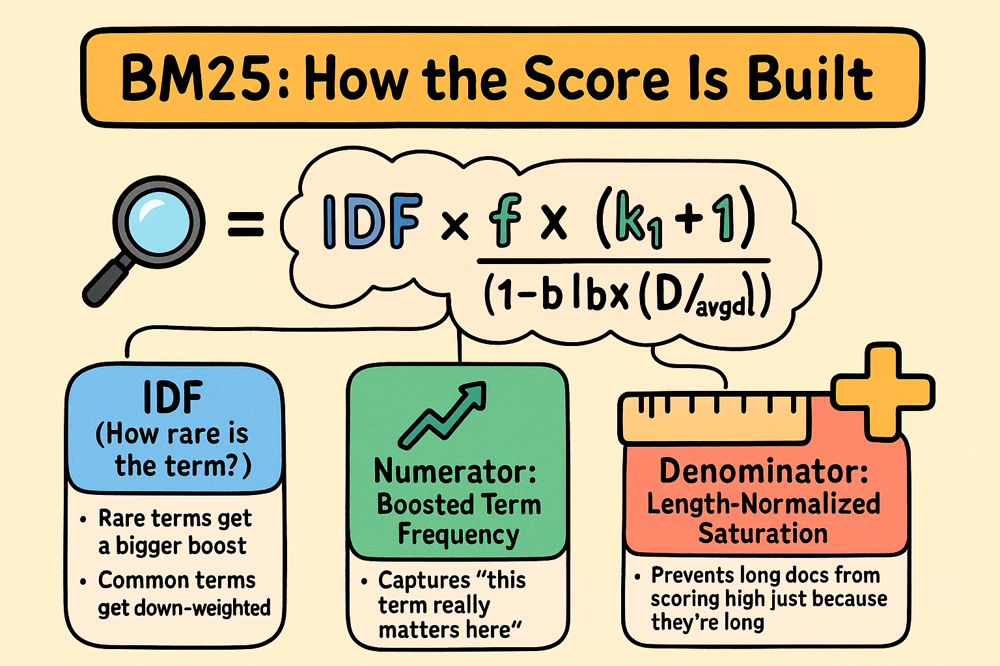
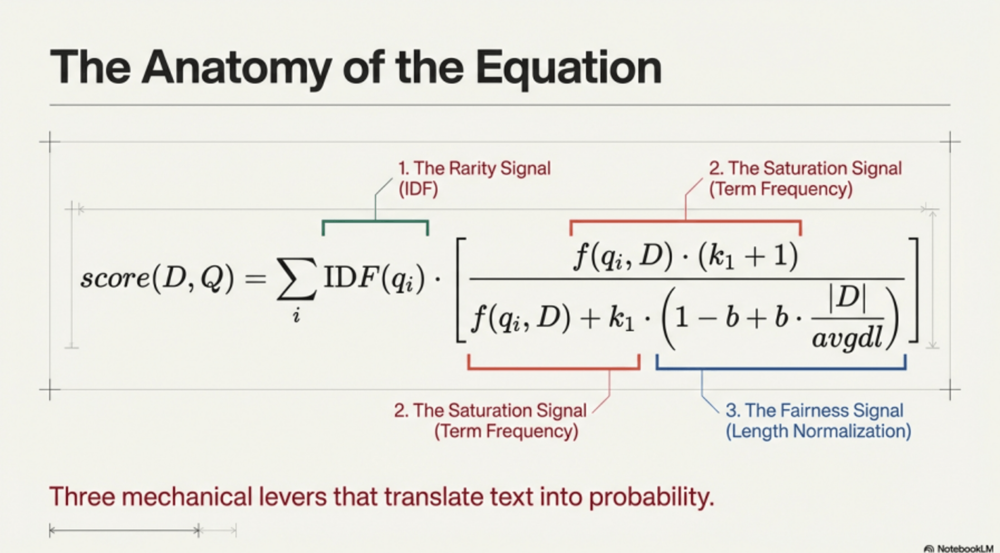
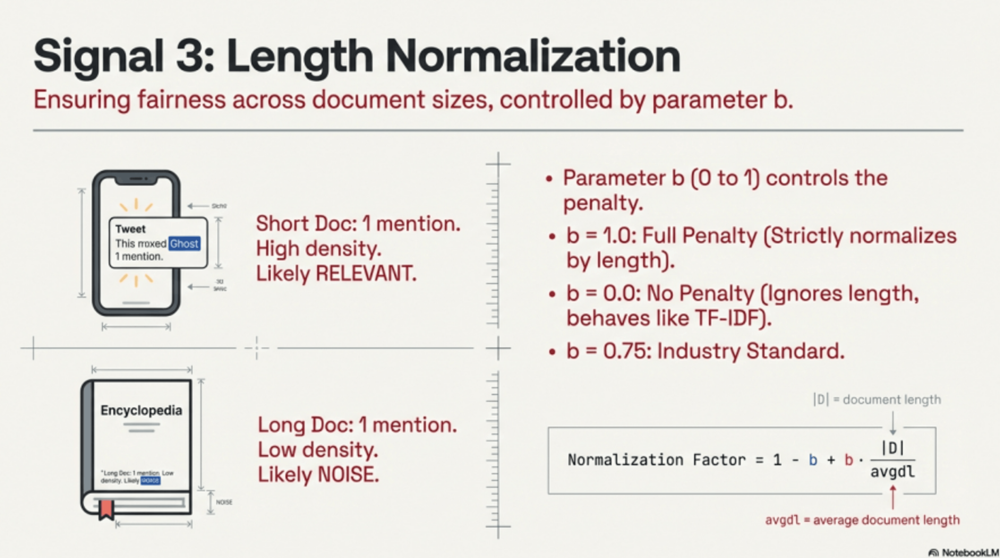

# BM25 


## What is BM25?

**BM25** (Best Matching 25th Iteration) is like TF-IDF's **smarter, more sophisticated cousin**. It's the algorithm that powers most modern search engines, including Elasticsearch and many parts of Google!

**Why is it better than TF-IDF?**
- It has **diminishing returns** - Adding the 10th "cat" doesn't help as much as adding the 2nd "cat"
- It considers **document length** - Longer docs aren't automatically penalized
- It has **tuning knobs** - You can adjust it for different use cases!


## The BM25 Formula




## The Formula Breakdown

```
BM25 = IDF × [(f × (k1 + 1)) / (f + k1 × (1 - b + b × |D| / avgdl))]
       │      │                  │
       │      │                  └─ Denominator (normalization)
       │      └─ Numerator (boosted frequency)
       └─ How rare is this term?

Where each query term contributes its own score, then we sum them all up!
```

**Remember:**
- IDF: How special is this word?
- Numerator: Boost the frequency (but not too much)
- Denominator: Normalize for document length and saturation
- Result: A score that balances everything perfectly!


```
BM25(D, Q) = Σ IDF(qi) × (f(qi, D) × (k1 + 1)) / (f(qi, D) + k1 × (1 - b + b × |D| / avgdl))

Where:
- D = Document being scored
- Q = Query (search terms)
- qi = Each term in the query
- f(qi, D) = Frequency of term qi in document D
- |D| = Length of document D (word count)
- avgdl = Average document length in collection
- k1 = Term frequency saturation parameter (usually 1.2 to 2.0)
- b = Length normalization parameter (usually 0.75)
```

**Don't panic!** We'll break this down step by step! 🧩

## Understanding the Parameters

### k1 (Term Frequency Saturation)
**Default: 1.2-2.0**

Controls how quickly we stop caring about additional word occurrences.

```
Word "cat" appears:
- 1 time: Very important! ⭐⭐⭐⭐⭐
- 2 times: More important! ⭐⭐⭐⭐⭐⭐
- 5 times: Somewhat more important ⭐⭐⭐⭐⭐⭐⭐
- 50 times: Not much more important (saturated) ⭐⭐⭐⭐⭐⭐⭐⭐
```

**Higher k1** = More weight to term frequency  
**Lower k1** = Less weight to term frequency

### b (Length Normalization)
**Default: 0.75**

Controls how much document length affects the score.

```
b = 0: Document length doesn't matter at all
b = 0.5: Document length matters somewhat
b = 0.75: Document length matters a good amount (default)
b = 1.0: Document length matters completely
```

**Higher b** = Longer docs penalized more  
**Lower b** = Longer docs penalized less







## Tuning Parameters for Different Use Cases

### Higher k1 (e.g., k1 = 2.0):

**Use when:**
- Longer documents are common
- Term frequency is very important
- E-commerce product descriptions
- Technical documentation

**Effect:** More emphasis on how often terms appear

### Lower k1 (e.g., k1 = 1.0):
**Use when:**
- Short documents (tweets, titles)
- Presence matters more than frequency
- News headlines

**Effect:** Less emphasis on repetition

### Higher b (e.g., b = 1.0):
**Use when:**
- Document lengths vary widely
- Shorter docs should be favored
- Blog posts vs. books

**Effect:** Strong length normalization

### Lower b (e.g., b = 0.5):
**Use when:**
- All documents are similar length
- Length shouldn't matter much
- Academic papers (all ~8 pages)

**Effect:** Weak length normalization

## Key Takeaways

**BM25 is smarter than TF-IDF because:**

1. **Diminishing Returns** 📉
   - The 2nd occurrence helps a lot
   - The 100th occurrence barely helps
   - Prevents keyword stuffing naturally

2. **Length Normalization** 📏
   - Short, focused docs get a bonus
   - Long, rambling docs get penalized
   - Adjustable with parameter b

3. **Tunable** 🎛️
   - k1 controls term frequency importance
   - b controls length normalization
   - Customize for your use case!

4. **More Realistic** 🎯
   - Mimics human relevance judgments
   - Used by Elasticsearch, Lucene, Solr
   - Industry standard for good reason!


## What's Next?

BM25 is still widely used today, but modern search also includes:
- **BM25+** - Handles term frequency = 0 better
- **BM25F** - Multi-field version (title, body, tags)
- **Neural Search** - BERT, sentence transformers
- **Hybrid Search** - BM25 + neural embeddings combined!

**But BM25 remains the gold standard for lexical search!** 

<br>