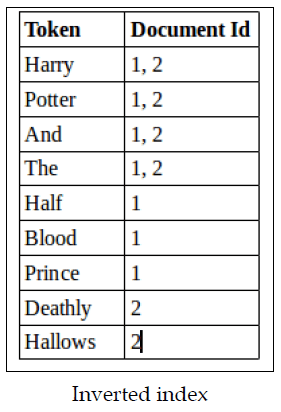

# Inverse Document Frequency (IDF)





**IDF** measures how rare or unique a term is across a collection of documents. It's the "inverted" part of TF-IDF (Term Frequency-Inverse Document Frequency).

## The Core Idea

Common words like "the" or "is" appear in almost every document, so they're not useful for distinguishing between documents. Rare words like "photosynthesis" or "cryptocurrency" appear in fewer documents and are more informative.

## The Formula

```
IDF(term) = log(N / df)
```

Where:
- **N** = total number of documents
- **df** = number of documents containing the term

## Example

Say you have 1,000 documents:
- "the" appears in 999 documents → IDF = log(1000/999) ≈ 0.001 (very low)
- "quantum" appears in 10 documents → IDF = log(1000/10) = 2 (higher)
- "riboflavin" appears in 1 document → IDF = log(1000/1) = 3 (highest)

## Why It Matters

When combined with Term Frequency (how often a word appears in a single document), IDF helps identify the most important words for each document. Words that appear frequently in one document but rarely across all documents get the highest TF-IDF scores.

This is fundamental to search engines, document classification, and information retrieval systems.

It’s a core ingredient in **TF‑IDF**, one of the most widely used scoring methods in search engines, information retrieval, and text mining.

## What IDF Tries to Solve

Some words appear in *almost every* document:

- “the”
- “is”
- “and”
- “of”

If a search engine treated these words as highly important, every document would look similar.  
IDF fixes this by **down‑weighting common words** and **up‑weighting rare, meaningful words**.

So if a student searches for:

> *“photosynthesis process”*

The word **“photosynthesis”** should matter far more than **“process”**.

## How IDF Is Calculated

The most common formula is:

The formula for Inverse Document Frequency (IDF) is:

**IDF(t) = log(N / df_t)**

Where:
- **N** = total number of documents in the corpus
- **df_t** = number of documents containing term t
- **log** = logarithm (typically natural log or log base 10)

**Common variations:**

1. **Smoothed IDF** (most common in practice):
   ```
   IDF(t) = log(N / df_t) + 1
   ```

2. **IDF with smoothing to avoid division by zero**:
   ```
   IDF(t) = log((N + 1) / (df_t + 1)) + 1
   ```

3. **Probabilistic IDF**:
   ```
   IDF(t) = log((N - df_t) / df_t)
   ```

**Key insight:** IDF increases for rare terms (low df_t) and decreases for common terms (high df_t). When combined with term frequency (TF), you get TF-IDF weighting:

**TF-IDF(t, d) = TF(t, d) × IDF(t)**

This smoothing ensures that terms appearing in all documents don't get zero weight and prevents division by zero for edge cases.

### Why the log?

Without the logarithm, rare terms would get *huge* scores.  

The log keeps values nicely scaled.

### Example

Imagine a collection of **1,000 documents**:

| Term | Documents Containing Term (\(df_t\)) | IDF |
|------|--------------------------------------|------|
| “the” | 980 | \( \log(1000/980) \approx 0.009 \) |
| “photosynthesis” | 12 | \( \log(1000/12) \approx 4.42 \) |
| “chlorophyll” | 5 | \( \log(1000/5) \approx 5.30 \) |

**Interpretation:**

- “the” → IDF near zero → contributes almost nothing  
- “photosynthesis” → high IDF → very informative  
- “chlorophyll” → even higher → extremely informative  

## Why IDF Is Important

### 1. It filters out noise
Common words don’t help distinguish one document from another.  
IDF ensures they don’t dominate search results.

### 2. It highlights meaningful terms
Rare terms often carry the *actual* meaning of a query.  
IDF boosts these so search engines can rank documents more intelligently.

### 3. It improves relevance
TF‑IDF (Term Frequency × IDF) combines:
- **TF** → how often a word appears in a document  
- **IDF** → how rare the word is across the whole collection  

Together, they create a balanced score that rewards documents that use important terms frequently.

### 4. It’s foundational for modern search
Even though we now have embeddings, transformers, and semantic search, IDF still:
- powers classical search engines  
- influences hybrid search systems  
- appears in ranking models like BM25  


## Putting It All Together

IDF is essentially a *discriminator*:  
It helps a search engine decide which words actually help identify the right documents.

- **Common words → low IDF → low importance**  
- **Rare words → high IDF → high importance**

This simple idea dramatically improves search quality and remains a cornerstone of information retrieval.

<br>